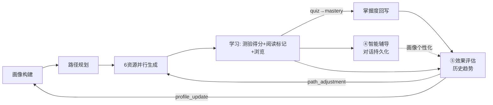

# 架构与流程图

> 项目：基于大模型的个性化资源生成与学习多智能体系统（软件杯 A3）
> 版本 v2.0

---

## 1. 系统分层架构

```
┌──────────────────────────────────────────────────────────────────┐
│                    前端 (React 19, App Router)                      │
│  资源生成    画像(仪表盘)   学习记录    辅导     评估    知识库   设置 │
│  ChatPanel  ProfileRadar   DetailPages  Tutor   Eval    KB管理   │
│  AgentPipe  热力图/统计    6种渲染器    历史    趋势图  上传/列表  │
├──────────────────────────────────────────────────────────────────┤
│                  API Routes (Node 服务端)                           │
│  /api/learn(SSE)  /api/tutor(SSE)  /api/eval(JSON)                │
│  /api/auth/{register,login,logout,me}                             │
│  /api/profile/{stats,suggestions}  /api/records                    │
│  /api/tutor/conversations  /api/eval/history                      │
│  /api/kb/{upload,files}  /api/settings/model                      │
├──────────────────────────────────────────────────────────────────┤
│                    核心逻辑层 (backend/)                             │
│  ┌──────────────┐ ┌────────────────┐ ┌──────────────────┐         │
│  │ graph.ts     │ │ agents/* (8个) │ │ ai/spark.ts      │         │
│  │ LangGraph    │ │ profile/planner│ │ 星火LLM客户端     │         │
│  │ 并行fan-out  │ │ 6资源/tutor/eval│ │ +WebSocket流式   │         │
│  └──────────────┘ └────────────────┘ └──────────────────┘         │
│  ┌──────────────┐ ┌────────────────┐ ┌──────────────────┐         │
│  │knowledge/    │ │knowledge/       │ │ auth/            │         │
│  │spark-kb.ts   │ │retriever.ts     │ │ prisma+jwt+      │         │
│  │ChatDoc云检索 │ │异步RAG包装      │ │ password+session │         │
│  └──────────────┘ └────────────────┘ └──────────────────┘         │
├──────────────────────────────────────────────────────────────────┤
│              数据层 Prisma + SQLite                                 │
│  User | Profile | LearnRecord | TutorConversation                  │
│  TutorMessage | EvalRecord                                          │
├──────────────────────────────────────────────────────────────────┤
│              外部服务                                                │
│  讯飞星火大模型(4.0Ultra)  ·  讯飞ChatDoc知识库(语义检索)             │
└──────────────────────────────────────────────────────────────────┘
```

---

## 2. 多智能体编排（LangGraph StateGraph）


---

## 3. 增强学习闭环



---

## 4. 防幻觉四层机制（云端版）

```
生成前 ──────────────────────────────────────── 生成后
┌───────────────────┐                  ┌───────────────────┐
│ 第1层 检索约束      │                  │ 第3层 事实核查      │
│ ChatDoc云端语义检索 │                  │ ChatDoc交叉验证     │
├───────────────────┤                  │ score / flagged    │
│ 第2层 Prompt 约束   │ ── 星火生成 ──>  ├───────────────────┤
│ 仅依KB、不得编造   │                  │ 第4层 引用标注      │
└───────────────────┘                  └───────────────────┘
```

---

## 5. SSE 流式协议 + Stream Manager

```
用户输入 → stream-manager.ts (模块级，导航安全)
              ↓
         POST /api/learn (SSE)
              ↓
    event: status        ← Agent状态
    event: profile       ← 画像构建完成
    event: path          ← 路径规划完成
    event: resource_start ×6
    event: resource_delta ×N (逐token)
    event: resource      ×6 (含fact_check)
    event: done
              ↓
    Zustand Store (全局状态)
     ├→ AgentPipeline (实时智能体状态)
     ├→ /learn (资源卡片)
     ├→ /profile (画像仪表盘)
     └→ /eval (评估数据)
```

stream-manager 独立于组件生命周期 — 切换页面不中断生成。

---

## 6. 认证与路由保护

```
proxy.ts (Next.js 16)
  ├─ /login, /, /api/auth/*  → 公开
  ├─ /learn, /profile, /tutor, /eval, /knowledge → 需JWT Cookie
  └─ 无效/过期 → 302 重定向 /login?from=原路径
```

---

## 7. 部署拓扑

```
┌─────────────────────────────────────────┐
│  Docker / standalone / npm run dev       │
│  ┌─────────────────────────────────┐     │
│  │ Next.js :3000                    │     │
│  │  ├ Prisma + SQLite (本地文件)    │     │
│  │  ├ 讯飞星火大模型 (HTTPS/WS)     │     │
│  │  └ ChatDoc知识库 (HTTPS)         │     │
│  └─────────────────────────────────┘     │
└─────────────────────────────────────────┘
```
