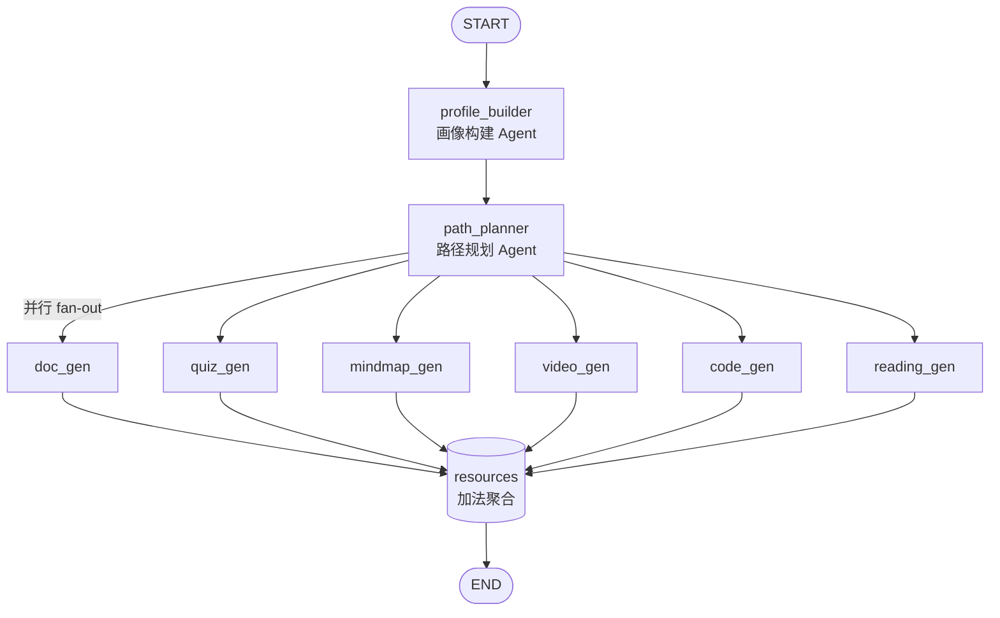
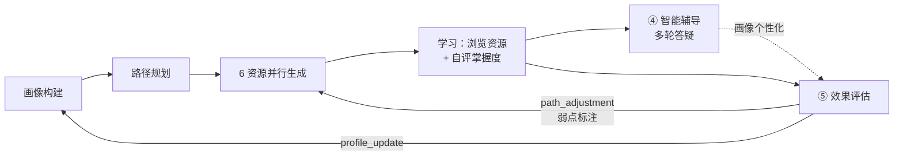

# 架构与流程图

> 项目：基于大模型的个性化资源生成与学习多智能体系统（软件杯 A3）
> 配合《系统开发说明书.md》阅读。版本 v1.0

---

## 1. 系统分层架构

```
┌───────────────────────────────────────────────────────────────┐
│                      前端 (React 19, App Router)                │
│   对话页        画像页       学习中心        辅导页      评估页    │
│  ChatPanel   ProfileRadar  ResourceCard   TutorChat  EvalRadar  │
├───────────────────────────────────────────────────────────────┤
│                   API Routes (Node 服务端, SSE/JSON)            │
│        /api/learn          /api/tutor          /api/eval        │
├───────────────────────────────────────────────────────────────┤
│                          核心逻辑层 (lib/)                       │
│  ┌─────────────────┐ ┌──────────────────┐ ┌─────────────────┐  │
│  │ graph.ts        │ │ agents/* (8 个)  │ │ ai/spark.ts     │  │
│  │ LangGraph 编排  │ │ profile/planner  │ │ 星火(兼容+路由)  │  │
│  │ (并行 fan-out)  │ │ 6 资源/tutor/eval│ │ + mock 兜底      │  │
│  └─────────────────┘ └──────────────────┘ └─────────────────┘  │
│  ┌──────────────────────┐ ┌──────────────────────────────────┐ │
│  │ knowledge/retriever  │ │ knowledge/fact-check             │ │
│  │ RAG 检索(第1层)      │ │ 事实核查(第3层)                  │ │
│  └──────────────────────┘ └──────────────────────────────────┘ │
├───────────────────────────────────────────────────────────────┤
│            backend/knowledge_base/  课程知识库（数据结构与算法）          │
└───────────────────────────────────────────────────────────────┘
```

---

## 2. 多智能体编排（LangGraph StateGraph）



- 规划完成后 6 个资源 Agent 并行执行；
- `resources` 通道使用加法 reducer 聚合；
- 各节点经 `emit` 回调把 `resource_start / resource_delta / resource` 流式推送至 SSE。

---

## 3. 学习闭环



- 评估输出 `profile_update` 回写画像（knowledge_level）；
- 评估输出 `path_adjustment.focus_topics` 在 `/learn` 标注「建议复习」。

---

## 4. 防幻觉四层机制

```
生成前 ──────────────────────────────────────── 生成后
┌───────────────────┐                  ┌───────────────────┐
│ 第1层 检索约束      │                  │ 第3层 事实核查      │
│ RAG 检索 KB → 上下文│                  │ 回查 KB 交叉验证    │
├───────────────────┤                  │ score / flagged    │
│ 第2层 Prompt 约束   │ ── 大模型生成 ──> ├───────────────────┤
│ 仅依 KB、不得编造   │                  │ 第4层 引用标注      │
│ 不确定须声明        │                  │ sources 来源展示   │
└───────────────────┘                  └───────────────────┘
```

---

## 5. SSE 流式协议（/api/learn）

```
前端 POST {message}
   │
   ▼  text/event-stream
event: status        data: {agent,message}          ← 各 Agent 状态
event: profile       data: {profile:{6维}}           ← 画像构建完成
event: path          data: {path:{steps[]}}          ← 路径规划完成
event: resource_start data: {id,resType,title,topic} ×6  ← 各资源开始
event: resource_delta data: {id,text}                ← 逐 token 流式（交错）
   ...
event: resource      data: {resource:{...,fact_check,sources}} ×6
event: done
```

辅导接口 `/api/tutor`：`event: delta{ text } … → done`。
评估接口 `/api/eval`：一次 JSON `{overall_score, mastery, weak_points, recommendations, profile_update, path_adjustment}`。

---

## 6. 部署拓扑（Docker）

```
┌─────────────────────────────────────┐
│  docker compose up --build           │
│  ┌───────────────────────────────┐  │
│  │ web (Next.js standalone)       │  │
│  │  node server.js  :3000         │  │
│  │  env: SPARK_API_KEY ...        │  │
│  │  内含 backend/knowledge_base/          │  │
│  └───────────────────────────────┘  │
└─────────────────────────────────────┘
        │ HTTPS（兼容端点）
        ▼
   讯飞星火大模型
```
